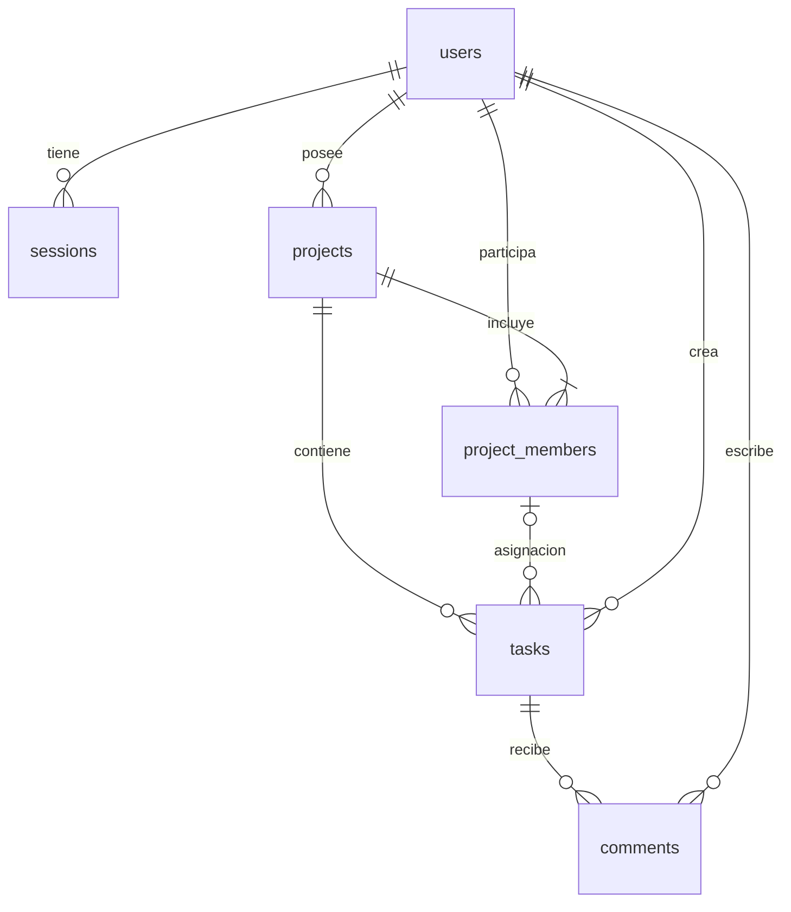

# PruebaElevate_Jennifer

Desarrollo de app para manejo y control de proyectos:

La aplicación está diseñada para poder permitir a equipos a organizar trabajos y proyectos: dentro de sus funcionalidades que permita crear proyectos y dentro de cada uno de los proyectos permita registrar tareas, estas tareas permita asignarlas a personas, llevar un seguimiento de las mismas por estado (todo/doing/done) y filtrar las tareas según diferentes categorías(por estado/prioridad y por persona asignada).
La aplicación debe permitir a usuarios autenticados gestionar proyectos y las tareas dentro de cada uno de ellos con la colaboración entre varios miembros (comentarios).
Debe permitir la autenticación y autorización (los usuarios solo deben acceder a los proyectos y tareas que les correspondan).
Autenticación:
-Registro e inicio de sesión de usuarios
-contraseñas almacenadas
-sesión gestionada (JWT o cookies de sesión)


LAS TAREAS:
CRUD de tareas dentro de un proyecto
Cada una de las tareas debe contener un titulo, descripción, mostrar el estado en la que se encuentra (todo/doing/done), mostrar la prioridad (baja/media/alta), mostrar a que persona está asignada y la fecha límite de la misma.

LOS PROYECTOS:
Cada proyecto puede tener varios miembros, y cada usuario/persona puede pertenecer a varios proyectos.

EL FRONTEND:
-Ver el listado de tareas con sus filtros
-Crear y editar tareas
-Actualización del estado de cada tarea de forma ágil

TECNOLOGÍAS A UTILIZAR:
Backend: con Fastity (Node.js) que exponga una API REST con validación de esquemas y manejo de errores centralizados.
Base de datos: con PostgreSQL con un modelo relacional correcto y migraciones versionadas.
Frontend: en React que consuma la API y ofrezca experiencia fluída. Uso de Vite como herramienta de build

---

## Aplicación implementada: Elevate

Gestión de proyectos y tareas con registro, inicio y cierre de sesión, colaboración por comentarios, miembros por proyecto, vistas de tablero/lista y filtros combinables por estado, prioridad, persona y texto. Interfaz en español adaptable a escritorio y móvil.

### Tecnologías

- **Backend:** Node.js, Fastify, `pg` y `dotenv` (dependencias de la base original).
- **Base de datos:** PostgreSQL. Modelo relacional definido en migraciones SQL versionadas, ejecutadas desde Node.js (enfoque code first sin ORM).
- **Frontend:** React, React DOM y Vite; CSS propio, sin bibliotecas de componentes.
- **Seguridad y pruebas:** módulos integrados de Node.js (`crypto`, `node:test`, `assert`).

### Requisitos previos

- Node.js **22.12 o superior** (verificado con Node.js 24).
- PostgreSQL en ejecución, una base creada y credenciales con permiso para crear tablas. No hace falta crear tablas manualmente.
- npm.

### Configuración y arranque

1. En `Backend`, ejecuta `npm ci`.
2. Si aún no existe `Backend/.env`, copia `Backend/.env.example` a `.env` y completa las credenciales. **Conserva tu `.env` existente** si ya conecta a PostgreSQL.

   ```dotenv
   PORT=3000
   HOST=127.0.0.1
   DB_USER=postgres
   DB_HOST=localhost
   DB_NAME=gestor_proyectos
   DB_PASSWORD=tu_contraseña
   DB_PORT=5432
   ```

3. Desde `Backend`, ejecuta `npm run dev` (desarrollo) o `npm start`.
4. En otra terminal, desde `Frontend`, ejecuta `npm ci` y `npm run dev`.
5. Abre **http://127.0.0.1:5173** y crea tu cuenta.

El backend aplica automáticamente las migraciones pendientes antes de escuchar conexiones. También puedes ejecutarlas por separado con `npm run migrate` en `Backend`. Se reutiliza la base configurada; no se borra ni se rellena con usuarios de demostración.

Vite redirige `/api` a `http://127.0.0.1:3000`. Si cambias el puerto del backend, actualiza también `Frontend/vite.config.js`. Usa siempre el mismo hostname durante la sesión (por ejemplo, `127.0.0.1`).

Para ejecutar la interfaz compilada:

```powershell
cd Frontend
npm run build
cd ../Backend
npm start
```

Abre **http://127.0.0.1:3000**. Fastify sirve los archivos generados por Vite. Para un despliegue con HTTPS, define `NODE_ENV=production`; las cookies usarán entonces `Secure`. No establezcas ese valor si pruebas por HTTP local.

### Cómo usarla

1. Regístrate y crea un proyecto.
2. Las otras personas crean sus propias cuentas. El propietario puede seleccionarlas por nombre y correo desde el botón de miembros, aunque ya pertenezcan a otros proyectos.
3. Crea tareas con título, descripción, prioridad, estado, asignación y fecha límite. El propietario ve dos grupos en **Persona asignada**: miembros del proyecto y otros usuarios registrados. Si selecciona a alguien del segundo grupo, esa persona se añade al proyecto al guardar la tarea, con acceso a sus tareas y comentarios. La asignación y fecha pueden quedar pendientes.
4. Cambia el estado directamente desde cada tarjeta; usa los filtros y alterna entre tablero y lista.
5. Abre el título de una tarea para consultar sus detalles y publicar comentarios.

Los proyectos comienzan vacíos y muestran únicamente información guardada en PostgreSQL. Las contraseñas, sesiones y datos nunca se almacenan en `localStorage`.

### Permisos y sesiones

- Cualquier usuario autenticado puede crear proyectos y consultar los proyectos de los que es miembro.
- El propietario es miembro automáticamente; es el único que puede editar/eliminar el proyecto y añadir/quitar miembros.
- Todos los miembros pueden crear, consultar, editar y eliminar tareas y publicar comentarios de sus proyectos.
- Una tarea siempre queda asignada a un miembro de su proyecto. El propietario puede elegir a otro usuario registrado al crear o editar una tarea: su incorporación y la asignación se guardan en la misma transacción. Los demás miembros solo pueden asignar a integrantes actuales. Una persona puede pertenecer a varios proyectos. Al quitarla de uno, sus tareas de ese proyecto quedan sin asignar y pierde el acceso a ese proyecto; sus comentarios y pertenencia a otros proyectos se conservan.
- Las tareas y comentarios de un proyecto ajeno no son accesibles, aunque se conozcan sus identificadores.
- Las contraseñas se guardan con `scrypt` y sal aleatoria. La sesión usa un token aleatorio en cookie `HttpOnly`, `SameSite=Lax`, con vencimiento de siete días; PostgreSQL conserva únicamente su hash. Cerrar sesión revoca ese token.
- Las escrituras requieren la cabecera `X-Requested-With: Elevate`; no se habilita CORS. Registro/login tienen un límite de 30 solicitudes por IP cada 15 minutos en cada proceso del servidor.
- Consultas parametrizadas, validación JSON Schema, transacciones, errores centralizados y restricciones relacionales protegen los datos.

### Modelo de datos y migraciones



`Backend/migrations/001_initial.sql` crea las tablas, claves foráneas, restricciones e índices. `002_numeric_ids.sql` convierte los identificadores de usuarios, proyectos y tareas a enteros autoincrementales (`1`, `2`, `3`, etc.), conservando datos, asignaciones, miembros, comentarios y sesiones. Cada tabla tiene su propia secuencia; PostgreSQL genera el ID automáticamente. Los registros existentes se numeran por fecha de creación y los nuevos continúan desde el último número. Las eliminaciones o inserciones fallidas pueden dejar saltos; no se renumeran los registros al borrar.

`schema_migrations` registra el nombre, checksum y fecha de cada migración. La ejecución es transaccional y usa un bloqueo para evitar carreras entre procesos. Una migración aplicada no debe modificarse: para cambios futuros crea `003_descripcion.sql`, `004_descripcion.sql`, etc. Las migraciones crean el esquema dentro de la base existente, no el servidor ni la base de datos PostgreSQL.

### API REST

Prefijo: `/api`. Cuerpos JSON y cookie de sesión para las rutas protegidas. Los errores devuelven `{ "error": { "message": "..." } }` y, en validación, `fields`.

| Método | Ruta | Función |
| --- | --- | --- |
| GET | `/test-db` | Comprobar disponibilidad de PostgreSQL |
| POST | `/auth/register` | Registrarse: `name`, `email`, `password` |
| POST | `/auth/login` | Iniciar sesión: `email`, `password` |
| GET | `/auth/me` | Consultar usuario de la sesión |
| POST | `/auth/logout` | Revocar sesión |
| GET, POST | `/projects` | Listar proyectos propios / crear |
| GET, PATCH, DELETE | `/projects/:projectId` | Consultar / editar / eliminar |
| GET, POST | `/projects/:projectId/members` | Listar / añadir mediante `email` |
| GET | `/projects/:projectId/assignees` | Listar miembros y, para el propietario, otros usuarios registrados disponibles |
| DELETE | `/projects/:projectId/members/:userId` | Quitar miembro |
| GET, POST | `/projects/:projectId/tasks` | Filtrar tareas / crear |
| GET, PATCH, DELETE | `/projects/:projectId/tasks/:taskId` | Consultar / editar / eliminar tarea |
| GET, POST | `/projects/:projectId/tasks/:taskId/comments` | Listar / añadir comentario con `body` |

Filtros de tareas: `status=todo|doing|done`, `priority=baja|media|alta`, `assignee_id=<entero positivo>|unassigned` y `search=<texto>`. Se pueden combinar. Los identificadores de usuarios, proyectos y tareas se devuelven como números en JSON; por ejemplo, `/projects/1/tasks/2`. Campos de tarea: `title`, `description`, `status`, `priority`, `assignee_id` (número entero positivo o `null` en JSON), `due_date` (ISO `YYYY-MM-DD` o `null`). `PATCH` de tareas acepta cualquiera de esos campos; `PATCH` de proyectos requiere `name` y admite `description`.

### Pruebas

Desde `Backend`, ejecuta `npm test`. Requiere PostgreSQL accesible mediante `.env` y permiso para crear un **esquema temporal de pruebas**. El runner usa un nombre aleatorio y lo elimina al terminar; no modifica los registros de la aplicación. Verifica autenticación, hashes, cookies, migraciones, CRUD, filtros, comentarios, autorización, revocación de acceso y persistencia después de recrear la aplicación.

Desde `Frontend`, ejecuta `npm run build` para validar la compilación.

Desde `Backend`, `npm run test:browser` comprueba el flujo visual completo con Chrome o Edge en modo invisible: registro, creación de proyecto/tarea, asignación, cambio de estado, comentarios, filtros, recarga y cierre/inicio de sesión. Requiere haber compilado el frontend y disponer de Chrome o Edge (o definir `BROWSER_PATH`). Usa un esquema temporal independiente y guarda capturas de escritorio/móvil en `artifacts/`, excluido de Git. No instala herramientas ni dependencias adicionales.

### Estructura

```text
Backend/
  migrations/001_initial.sql
  migrations/002_numeric_ids.sql
  src/app.js         # API, autorización, errores y archivos estáticos
  src/auth.js        # Contraseñas y sesiones
  src/db.js          # Conexión y transacciones
  src/migrate.js     # Ejecutor de migraciones versionadas
  src/schemas.js     # Validación de entradas
  test/app.test.js   # Integración con PostgreSQL real
  server.js          # Migraciones y arranque
Frontend/
  src/App.jsx        # Autenticación y proyectos
  src/ProjectView.jsx # Tareas, miembros y comentarios
  src/TaskForm.jsx    # Crear/editar tareas y seleccionar personas
  src/Members.jsx     # Incorporar usuarios registrados al proyecto
  src/components.jsx # Elementos compartidos
  src/api.js         # Cliente HTTP
  src/styles.css     # Diseño adaptable
plan.md              # Seguimiento del trabajo y comprobaciones
```

Referencias de implementación: [validación de Fastify](https://fastify.dev/docs/latest/Reference/Validation-and-Serialization/), [Vite](https://vite.dev/guide/) y [criptografía de Node.js](https://nodejs.org/api/crypto.html).
